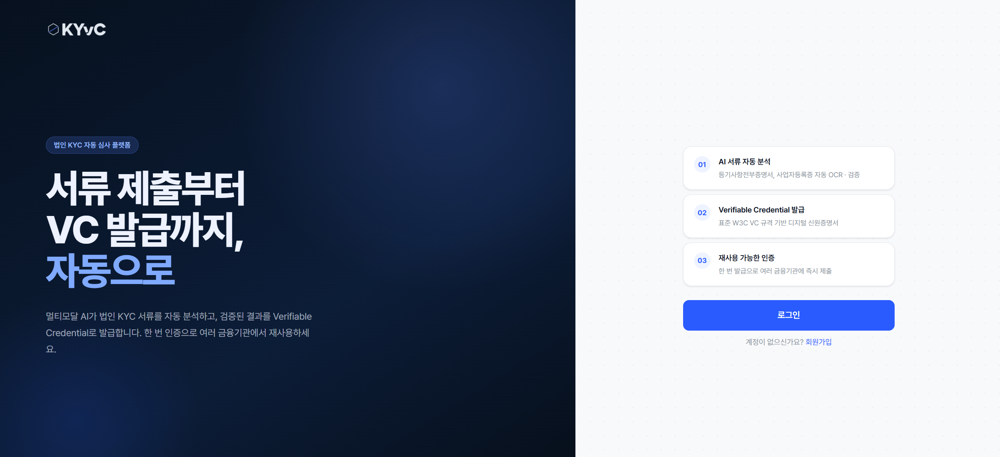

# KYvC Frontend



## 1. 서비스 개요

### 사용자 유형

- 법인 사용자
- 모바일 연동 사용자

### 담당 화면

- 회원가입
- 로그인
- 법인 정보 입력
- KYC 신청
- 제출서류 업로드
- KYC 진행 상태 조회
- VC 발급 QR
- VP 요청 QR
- 모바일 웹뷰 연동 화면

### 서비스 역할

법인 사용자가 KYC 신청과 VC/VP 흐름을 사용할 수 있는 사용자 웹 화면을 제공한다.

### 서비스 도메인

| 도메인 | 환경 | 대상 서비스 |
| --- | --- | --- |
| `dev-kyvc.khuoo.synology.me` | dev | Synology DSM Reverse Proxy / Frontend 통합 Nginx / 사용자 프론트 |

## 2. 기술 스택

### 언어

- TypeScript
- TSX

### 프레임워크

- Next.js 16
- React 19
- App Router

### 패키지 매니저

- npm 기준 실행 스크립트 제공
- `package-lock.json`과 `pnpm-lock.yaml`이 함께 있어 패키지 매니저 통일 기준은 저장소 기준 확인 필요

### 주요 라이브러리

- Tailwind CSS 4
- axios
- qrcode.react
- react-hook-form
- lucide-react
- Radix UI Label/Separator/Slot
- class-variance-authority
- clsx
- tailwind-merge

## 3. 화면 구성

### 주요 라우트

| Route | 담당 화면 |
| --- | --- |
| `/` | 사용자 진입 화면 |
| `/login` | 법인 사용자 로그인 |
| `/signup` | 회원가입 흐름 |
| `/signup/email-verify` | 회원가입 전 이메일 인증 |
| `/signup/info` | 회원가입 정보 입력 |
| `/signup/complete` | 회원가입 완료 후 로그인 이동 안내 |
| `/corporate` | 법인 사용자 대시보드 |
| `/corporate/profile` | 법인 기본 정보 |
| `/corporate/representative` | 대표자 정보 |
| `/corporate/agents` | 대리인 정보 |
| `/corporate/documents` | 제출서류 관리 |
| `/corporate/kyc` | KYC 신청 현황 |
| `/corporate/kyc/apply` | KYC 신청 흐름 |
| `/corporate/kyc/detail` | KYC 상세와 진행 상태 |
| `/corporate/vc` | VC 발급/상태 |
| `/corporate/vp` | VP 요청/제출 흐름 |
| `/wallet` | 웹 지갑 진입 |
| `/wallet/scan` | QR 스캔 |
| `/m/**` | 모바일 웹뷰 연동 화면 |

### 사이트맵

```text
frontend
├─ app
│  ├─ login
│  ├─ signup
│  │  ├─ email-verify
│  │  ├─ terms
│  │  ├─ info
│  │  └─ complete
│  ├─ corporate
│  │  ├─ profile
│  │  ├─ representative
│  │  ├─ agents
│  │  ├─ documents
│  │  ├─ kyc
│  │  ├─ vc
│  │  └─ vp
│  ├─ wallet
│  ├─ finance
│  └─ m
├─ components
├─ lib
└─ public
```

## 4. API 연동 구조

### 호출 대상 서버

- `backend`
- frontend는 backend API만 호출한다.
- frontend는 `backend_admin`, `core`, `core_admin`을 직접 호출하지 않는다.

### API Prefix

실제 `frontend/lib/api.ts` 기준 주요 prefix는 다음과 같다.

| Prefix | 용도 |
| --- | --- |
| `/api/auth/**` | 회원가입, 로그인, 로그아웃, 토큰 재발급, MFA, 이메일 인증 |
| `/api/common/**` | 세션, 공통 알림, DID 기관 조회 |
| `/api/user/**` | 사용자 대시보드, 법인 정보, 문서, Credential, VP 이력 |
| `/api/corporate/**` | KYC 신청, 제출서류, 보완, VC 발급 안내 |
| `/api/mobile/**` | 모바일 인증, QR 해석, VP 제출, 모바일 지갑 |
| `/api/finance/**` | 금융사 KYC, 금융사 VP 요청 |
| `/api/verifier/**` | 외부 Verifier 연동 |

### 인증/세션 처리

- HttpOnly Cookie 기반 Access/Refresh Token 사용 기준이다.
- axios 공통 client는 `withCredentials: true`로 Cookie를 포함한다.
- 401 응답 시 `/api/auth/token/refresh` 기준으로 재발급을 시도한다.
- 프론트에서 토큰 원문을 직접 저장하거나 노출하지 않는 기준을 따른다.
- 민감정보는 `localStorage` 또는 `sessionStorage`에 저장하지 않는다.
- 회원가입은 회원가입 전 이메일 인증 방식이다.
- 이메일 인증 성공 후 회원가입 API를 호출한다.
- 회원가입 성공 후 자동 로그인하지 않고 로그인 화면으로 이동하는 기준이다.

## 5. 주요 환경 변수

- `NEXT_PUBLIC_API_BASE_URL`: 문서 미리보기 등 브라우저에서 직접 여는 backend API URL로 변경
- `NEXT_PUBLIC_KYVC_ENV`: Docker 빌드 환경에 맞게 `dev` 또는 `prod`로 변경
- `frontend/lib/api.ts`의 `BASE_URL`: 배포 환경에 맞는 backend API URL로 변경

## 6. 실행 구조

### 패키지 설치

```bash
cd frontend
npm install
```

### 로컬 실행

```bash
cd frontend
npm run dev
```

### 빌드

```bash
cd frontend
npm run build
```

## 7. 개발 규칙

### 작업 경계

| 구분 | 기준 |
| --- | --- |
| 수정 범위 | `frontend` 작업은 `frontend` 디렉터리 내부에서만 수행 |
| 관리자 화면 | `frontend_admin` 영역에서 구현 |
| Core 관리자 화면 | `frontend_core_admin` 영역에서 구현 |
| API 소유권 | 사용자 화면은 backend 사용자 API 기준으로 연동 |

### API 호출 및 인증

| 영역 | 필수 기준 | 금지 또는 주의 |
| --- | --- | --- |
| API client | 공통 API client 또는 `lib` 구조 사용 | 화면 컴포넌트에서 API URL 임의 조립 금지 |
| 호출 대상 | frontend는 backend API만 호출 | `backend_admin`, `core`, `core_admin` 직접 호출 금지 |
| 인증/세션 | HttpOnly Cookie 흐름 유지 | Access/Refresh Token 원문을 브라우저 저장소나 화면에 노출 금지 |
| 회원가입 | 이메일 인증 완료 후 회원가입 API 호출 | 회원가입 성공 후 자동 로그인 흐름 추가 금지 |

### 화면 및 데이터 처리

| 영역 | 필수 기준 | 금지 또는 주의 |
| --- | --- | --- |
| 라우팅 | 기존 App Router 디렉터리와 라우팅 구조 준수 | 임의 라우트 구조 신설 금지 |
| UI 구성 | `components` 하위 기존 공통 UI 우선 사용 | 중복 컴포넌트 임의 생성 지양 |
| 공통 로직 | `lib` 하위 기존 구조 사용 | 화면별 중복 유틸 작성 지양 |
| 민감정보 | 화면 상태에는 필요한 표시 데이터만 유지 | 민감정보, VC/VP 원문, 문서 원문을 상태나 로그에 저장 금지 |
