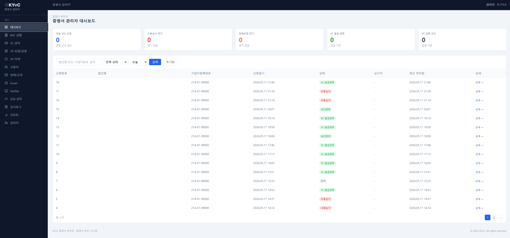

# KYvC Frontend Admin



## 1. 서비스 개요

### 사용자 유형

- 백엔드 업무 관리자
- 시스템 관리자

### 담당 화면

- 관리자 로그인
- 대시보드
- KYC 신청 목록
- KYC 신청 상세
- 제출서류 미리보기
- AI 심사 결과
- 수동심사
- 보완요청
- VC 발급 상태
- 법인 사용자 관리
- Issuer 신뢰정책
- 감사로그

### 서비스 역할

KYC 업무 운영과 심사 처리를 위한 관리자 웹 화면을 제공한다.

### 서비스 도메인

| 도메인 | 환경 | 대상 서비스 |
| --- | --- | --- |
| `dev-admin-kyvc.khuoo.synology.me` | dev admin | Synology DSM Reverse Proxy / Frontend 통합 Nginx / 백엔드 어드민 프론트 |

## 2. 기술 스택

### 언어

- TypeScript
- TSX

### 프레임워크

- Next.js 16
- React 19
- App Router

### 패키지 매니저

- npm 기준 실행 스크립트 제공
- `package-lock.json`과 `pnpm-lock.yaml`이 함께 있어 패키지 매니저 통일 기준은 저장소 기준 확인 필요

### 주요 라이브러리

- Tailwind CSS 3
- shadcn
- @base-ui/react
- Radix UI Label/Separator/Slot
- lucide-react
- qrcode.react
- class-variance-authority
- clsx
- tailwind-merge
- tw-animate-css

## 3. 화면 구성

### 주요 라우트

| Route | 담당 화면 |
| --- | --- |
| `/` | 관리자 진입 화면 |
| `/login` | 관리자 로그인 |
| `/login/mfa` | 관리자 MFA |
| `/login/reset` | 비밀번호 재설정 |
| `/dashboard` | 관리자 대시보드 |
| `/kyc` | KYC 신청 목록 |
| `/kyc/[id]` | KYC 신청 상세 |
| `/kyc/[id]/ai-result` | AI 심사 결과 |
| `/kyc/[id]/manual-review` | 수동심사 |
| `/kyc/[id]/re-review` | 재심사 |
| `/kyc/[id]/supplement-request` | 보완요청 |
| `/kyc/[id]/supplement-history` | 보완 이력 |
| `/kyc/[id]/review-history` | 심사 이력 |
| `/vc` | VC 발급 상태 |
| `/vc/[id]` | VC 상세 |
| `/vc/[id]/reissue` | VC 재발급 |
| `/vc/[id]/revoke` | VC 폐기 |
| `/vp` | VP 검증 결과 |
| `/users` | 법인 사용자 관리 |
| `/corporates` | 법인 정보 관리 |
| `/issuer` | Issuer 관리 |
| `/issuer/approval` | Issuer 승인 |
| `/issuer/whitelist` | Issuer whitelist |
| `/issuer/blacklist` | Issuer blacklist |
| `/issuer-policy` | Issuer 정책 |
| `/audit-log` | 감사로그 |
| `/report` | 운영 리포트 |
| `/managers` | 관리자 계정 |
| `/managers/groups` | 관리자 권한 그룹 |
| `/common-codes` | 공통코드 |
| `/settings/notifications` | 알림 템플릿 |

### 사이트맵

```text
frontend_admin
├─ app
│  ├─ login
│  └─ (admin)
│     ├─ dashboard
│     ├─ kyc
│     ├─ vc
│     ├─ vp
│     ├─ users
│     ├─ corporates
│     ├─ issuer
│     ├─ issuer-policy
│     ├─ audit-log
│     ├─ report
│     ├─ managers
│     ├─ common-codes
│     └─ settings
├─ components
├─ lib
│  └─ api
├─ public
└─ types
```

## 4. API 연동 구조

### 호출 대상 서버

- `backend_admin`
- frontend_admin은 backend_admin API만 호출한다.
- frontend_admin은 `backend`, `core`, `core_admin`을 직접 호출하지 않는다.
- Core 기술 운영 화면은 frontend_admin 범위가 아니다.
- AI 모델 설정, Azure OpenAI 설정, Credential Schema, XRPL 트랜잭션, SDK 메타데이터, Core 배포 이력, Core 감사로그는 `core_admin`과 `frontend_core_admin` 영역이다.

### API Prefix

| Prefix | 용도 |
| --- | --- |
| `/api/admin/auth/**` | 관리자 로그인, 로그아웃, 토큰 재발급, MFA, 비밀번호 재설정, 세션 |
| `/api/admin/me/**` | 관리자 본인 정보 |
| `/api/admin/backend/**` | BADM 업무 API |

주요 API 모듈은 `frontend_admin/lib/api` 아래 도메인별 파일로 분리되어 있다.

### 인증/세션 처리

- 관리자 JWT + HttpOnly Cookie + Role 기반 권한 확인 기준이다.
- API 호출은 `credentials: "include"` 기준으로 Cookie 세션을 포함한다.
- 관리자 보호 라우트는 세션 확인 후 접근한다.
- 토큰 원문을 화면에 표시하지 않는다.
- 일반 관리자와 시스템 관리자 권한에 따라 화면 접근과 API 호출 범위를 분리한다.

## 5. 주요 환경 변수

- `BACK_ADMIN_API_URL`: Next rewrites가 전달할 backend_admin API URL로 변경
- `NEXT_PUBLIC_ADMIN_API_BASE_URL`: 브라우저에서 호출할 관리자 API URL로 변경
- `NEXT_PUBLIC_API_BASE_URL`: 공통 API base fallback이 필요한 환경에서 실제 관리자 API URL로 변경
- `NEXT_PUBLIC_BACKEND_API_BASE_URL`: BADM 화면에서 backend 사용자 API를 조회해야 하는 예외 화면의 backend API URL로 변경

## 6. 실행 구조

### 패키지 설치

```bash
cd frontend_admin
npm install
```

### 로컬 실행

```bash
cd frontend_admin
npm run dev
```

### 빌드

```bash
cd frontend_admin
npm run build
```

## 7. 개발 규칙

### 작업 경계

| 구분 | 기준 |
| --- | --- |
| 수정 범위 | `frontend_admin` 작업은 `frontend_admin` 디렉터리 내부에서만 수행 |
| 화면 기준 | BADM 화면 기준으로 작성 |
| 사용자 화면 | `frontend` 영역에서 구현 |
| Core 관리자 화면 | `frontend_core_admin` 영역에서 구현 |

### API 호출 및 인증

| 영역 | 필수 기준 | 금지 또는 주의 |
| --- | --- | --- |
| API client | `frontend_admin/lib/api/{domain}.ts` 구조 사용 | 화면 컴포넌트에서 API URL 임의 조립 금지 |
| 호출 대상 | frontend_admin은 backend_admin API만 호출 | `backend`, `core`, `core_admin` 직접 호출 금지 |
| 응답 처리 | backend_admin API 응답 구조에 맞춰 구현 | Core raw 응답을 화면 모델로 직접 사용 금지 |
| 인증/세션 | 관리자 JWT + HttpOnly Cookie + Role 기반 권한 확인 유지 | 토큰 원문, Cookie 값, 인증 헤더 값 노출 금지 |
| 권한 분리 | 일반 관리자와 시스템 관리자 접근 범위 분리 | 권한 경계가 모호한 공용 화면 작성 금지 |

### 화면 및 데이터 처리

| 영역 | 필수 기준 | 금지 또는 주의 |
| --- | --- | --- |
| 라우팅 | 기존 App Router 구조와 `(admin)` 라우트 그룹 준수 | 관리자 화면 라우트 임의 분산 금지 |
| UI 구성 | `components` 하위 기존 공통 레이아웃과 UI 우선 사용 | 중복 컴포넌트 임의 생성 지양 |
| 관리자 응답 표시 | 업무 표시용 가공 데이터만 화면에 노출 | Core raw payload, `coreRequestId`, Core trace 직접 노출 금지 |
| 민감정보 | 화면 상태에는 필요한 표시 데이터만 유지 | VC/VP 원문, 문서 원문, private key를 상태나 로그에 저장 금지 |
